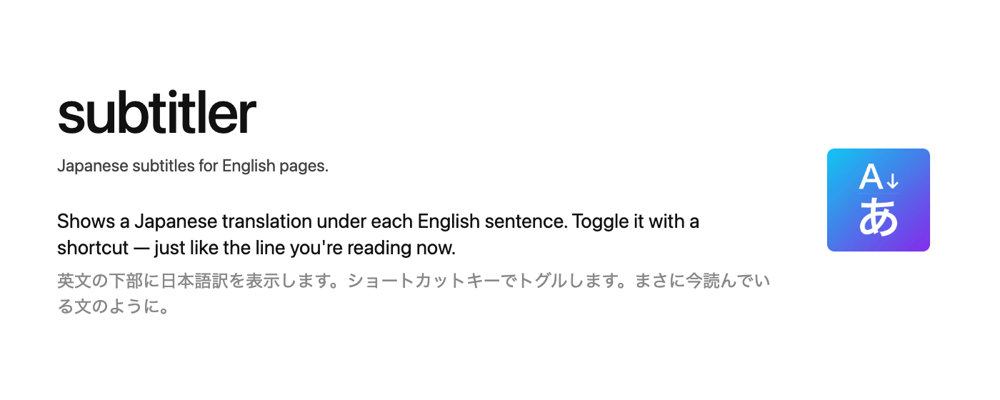

<p align="center">
  
</p>

# subtitler

英語ページの各文の下に、字幕のように日本語訳を表示するトグル式の Chrome 拡張機能です。原文はそのまま残り、訳文は文単位ですぐ下に挿入されるので、両方を並べて読めます。

翻訳は Chrome 組み込みの Translator API によりすべて端末内で実行され、外部サーバーには一切送信されません。

## 特長

- **ショートカットでオン／オフ切り替え** — ページをリロードせずに訳文の表示・非表示を即座に切り替え。
- **文単位での対応付け** — ページ末尾にまとめて表示するのではなく、英語の各文の直後に訳文を挿入。
- **`IntersectionObserver` による遅延翻訳** — ビューポートに入った文だけを翻訳するため、長いページでも軽快でモデル呼び出しも抑えられます。
- **同時実行数を絞った翻訳キュー** — 同時に翻訳される文は最大数件までに制限。
- **動的コンテンツ対応** — `MutationObserver` により SPA や無限スクロールで追加されたテキストにも追従。
- **UI ラベルのフィルタ** — `<button>` / `role="button"` / 単独の `<a>` / `<label>` / `<summary>` などの中の短いテキストはスキップし、ナビリンクやボタンのラベルが汚れないようにしています。リンクテキストが URL そのものの場合もスキップします。
- **インラインリンクを含む文への対応** — 文の途中にリンクがある場合（例: `For more information, visit the <a>EC2 M8i instance</a> page.`）でも、断片に分割せず一つの文として翻訳します。
- **オンデバイス翻訳** — Chrome の `Translator` API（`en` → `ja`）を使用。モデルは初回利用時に一度だけダウンロードされます。

## 動作要件

- Translator API が利用できる Chrome **138+**（または同等バージョンの Chromium 系ブラウザ）。
- `en` → `ja` の翻訳モデル。初回起動時にダウンロードを促され、以降はキャッシュされたモデルを使用します。

## インストール（unpacked）

1. このリポジトリを clone するかダウンロードします。
2. `chrome://extensions/`（Arc の場合は `arc://extensions/`）を開きます。
3. **デベロッパーモード**を有効にします。
4. **パッケージ化されていない拡張機能を読み込む** をクリックし、`extension/` ディレクトリを選択します。

## 使い方

- **キーボードショートカット**: 既定は `Alt+Shift+Y`（macOS では Option+Shift+Y）。1 回押すと現在のページを翻訳、もう一度押すと非表示、さらにもう一度押すと再表示します。`chrome://extensions/shortcuts`（Arc では `arc://extensions/shortcuts`）から任意のキーに変更できます。
- **ツールバーアイコン**: subtitler のアイコンをクリックするとショートカットと同じ動作をします。
- **初回ダウンロード**: 新しいプロファイルでの初回翻訳時には、翻訳モデルのダウンロードを確認するバナーが表示されます。**Download** をクリックするか、**Cancel** で中止できます。

### ダウンロード済み翻訳モデルの削除

ダウンロード済みの翻訳モデルを削除して再ダウンロードの挙動を確認したい場合は、`chrome://on-device-translation-internals/` を開き、`en` → `ja` のエントリで **Uninstall** をクリックします。次回トグル時に再びダウンロード確認バナーが表示されます。

### 動作しないページ

以下のページではコンテンツスクリプトを注入できません。

- `chrome://` / `arc://` / `about:` ページ
- Chrome ウェブストア
- PDF ビューア
- 注入スクリプトをブロックする厳格な CSP が設定されたページ

## プライバシー

- 翻訳はすべて Chrome の Translator API により端末内で行われます。
- 拡張機能から外部へのネットワークリクエストは行いません。
- `permissions` に関わる挙動は、`<all_urls>` でのコンテンツスクリプト注入のみで、これは閲覧中のページに翻訳をレンダリングするために必要です。

## サポート

本拡張機能は無料で配布されています。継続的な開発・メンテナンスを支援していただける方は <https://itouuuuuuuuu.github.io/sponsor.html> をご覧ください。Ko-fi 経由で任意の寄付を受け付けています（リポジトリ右上の **Sponsor** ボタンからもアクセスできます）。

## 既知の制約

- 翻訳キャッシュはインメモリで、ページのライフタイム中は上限なく保持されます。
- 英語 → 日本語以外の言語は対応していません。
- **デスクトップビューポート前提**: 視覚的に隠された要素のスキップ判定で Tailwind の variant prefix（`md:sr-only`、`focus:not-sr-only` など）はクラス名のみで判断し、現在の breakpoint/状態は確認しません。デスクトップ幅では実用上問題ありませんが、ブラウザ幅を狭めて使用した場合に variant が一致しないクラスで判定が反転することがあります。

---

# 開発者向け

## 仕組み

1. トグル時、コンテンツスクリプトは `en` → `ja` の `Translator` インスタンスがあることを確認します。モデル未ダウンロードの場合は、ユーザー操作によるダウンロード開始を促すバナーを表示します。
2. `document.body` をブロック単位（`<p>`, `<li>`, `<div>` など）で走査し、`<script>`, `<style>`, `<code>`, `<pre>`、contenteditable 領域、すでに注入済みのノードはスキップします。
3. 各ブロック内では、隣接するテキストノードとインライン要素（`<a>`, `<em>` など）のテキストを連結したフラットなストリームを `Intl.Segmenter` で文に分割します。UI ラベルらしき文（ボタン内の短いテキスト、単独で短いリンク、ラベル類）や、リンクテキストが URL そのものの文は除外します。
4. 残った文の直後に `<span class="subtitler-loading">Translating...</span>` のプレースホルダを挿入します。
5. 各プレースホルダを `IntersectionObserver` で監視し、ビューポートに入った（200px のマージン付き）時点で翻訳キューに投入します。
6. 同時実行数の上限を 4 とした小さなキューが処理を行い、翻訳結果が返るとプレースホルダを `<span class="subtitler-ja">…</span>` に置き換えます。
7. `MutationObserver` により後から追加された DOM ノード（SPA のページ遷移、遅延読み込みされたセクションなど）を捕捉し、同じパイプラインで処理します。自身が注入したノードは `WeakSet` で記録してフィードバックループを防ぎます。
8. 表示のオン／オフ切り替えは、注入済みの全要素のインライン `display` を反転するだけで済み、再翻訳は行いません。

## ファイル構成

```
extension/
  manifest.json   # MV3 マニフェスト、commands、content_scripts
  background.js   # service worker: ショートカットとツールバークリックを中継
  content.js      # メインロジック: 収集・翻訳・各種 observer
  styles.css      # 字幕、ローディング、バナーのスタイル
tests/
  setup.mjs       # ブラウザ API のモック (chrome.*, Translator, IntersectionObserver, requestIdleCallback)
  content.test.mjs
  background.test.mjs
```

## テスト

Vitest + jsdom によるテストスイートを同梱しています。カバー範囲は以下のとおりです。

- 純粋なヘルパー（`hasLatinLetter`, `isToggleShortcut`, `shouldTranslate`）
- DOM パイプライン（`processTextNode`, `collectAndInject`, `collectFromTextNode`, `replaceLoadingWithTranslation`, `setVisibility`）
- トグルの状態遷移（`handleToggle`）
- `IntersectionObserver` による遅延翻訳フロー
- インメモリの翻訳キャッシュ
- `<option>` のスキップルール
- SPA が翻訳済みサブツリーを再配置した際の、重複字幕を防ぐべき再走査の冪等性

```sh
npm install         # 初回のみ
npm test            # スイートを 1 回実行
npm run test:watch  # ファイル変更で再実行
npm run test:coverage
```

ブラウザのグローバル（`chrome.*`, `Translator`, `IntersectionObserver`, `requestIdleCallback`）は `tests/setup.mjs` でモック化しています。テストは実際の `extension/content.js` と `extension/background.js` モジュールを読み込みます。両ファイルとも `typeof module` でガードした CommonJS の `module.exports` ブロックを公開しており、ブラウザでは何もしませんが、これにより vitest からソースをそのまま利用できます。

## Chrome ウェブストアへのリリース

リリースは「ローカルで bump → タグ push → GitHub Actions が ZIP を作って Release を公開」というシンプルな流れです。

| ワークフロー | トリガー | 内容 |
| --- | --- | --- |
| `ci.yml` | すべての PR と `main` への push | テスト実行、ZIP のビルド、artifact としてアップロード、`package.json` と `extension/manifest.json` のバージョン不一致は失敗扱い |
| `release.yml` | タグ push（`v*`）または手動（`workflow_dispatch`） | 対象タグからビルドし、`subtitler-X.Y.Z.zip` を添付した GitHub Release を公開 |
| `build-zip.yml` | 手動（`workflow_dispatch`） | 対象タグから ZIP のみをビルドし、ワークフローの artifact としてダウンロード可能にする（Release は作成しない） |

### リリース手順

```sh
git checkout main && git pull
npm version patch       # または minor / major — package.json と manifest.json を bump、コミット、タグ作成
git push --follow-tags  # bump コミットとタグを push
```

タグ push が `release.yml` を起動し、数十秒で GitHub Release と `subtitler-X.Y.Z.zip` が公開されます。あとは <https://chrome.google.com/webstore/devconsole> に ZIP をアップロードしてください。ストア情報は [`STORE_LISTING.md`](STORE_LISTING.md)、プライバシーポリシーは [`PRIVACY.md`](PRIVACY.md) を参照。

`npm version` は `version` ライフサイクルで `scripts/sync-version.mjs` を呼び、`extension/manifest.json` も同じバージョンに揃えてくれます。

### 既存バージョンの ZIP を取得する

リリースを作らずに ZIP だけ欲しい場合は **Actions → Build ZIP → Run workflow** で対象バージョン（例: `0.1.1`）を指定して実行します。完了後、ワークフロー実行ページの **Artifacts** から ZIP をダウンロードできます。

### 既存タグからリリースを再作成する

何らかの理由で `release.yml` が失敗した、もしくは Release を作り直したい場合は **Actions → Release → Run workflow** で対象バージョンを指定して手動実行できます。タグは事前に存在している必要があります。

### プロモアセット

`assets/` 配下に既に生成済みです。

- `assets/promo-440x280.png` — 小サイズのプロモタイル（ウェブストアで必須）。
- `assets/promo-1400x560.png` — マーキータイル（任意。注目枠への掲載に使用）。
